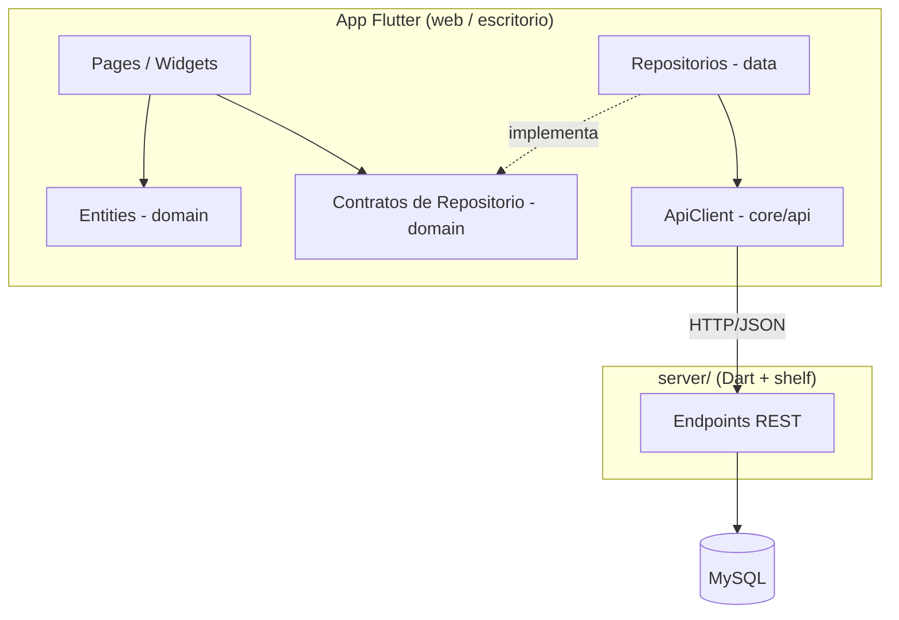
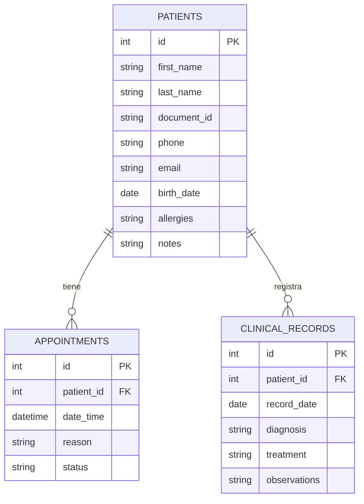

# Arquitectura del Sistema — Clínica Dental

## Visión general

Sistema en 3 partes: la **app Flutter** (web o escritorio), una **API REST en Dart** (`server/`) y la base de datos **MySQL**. El navegador no permite conexiones directas a MySQL, por lo que toda la app pasa por la API; esto además permite que varias computadoras del consultorio compartan los mismos datos.

## Regla de dependencias

- `presentation` solo conoce a `domain` (nunca a `data`).
- `domain` no depende de nada externo (Flutter, HTTP, MySQL).
- `data` implementa los contratos de `domain` llamando a la API REST.
- `core/` contiene lo transversal: tema, rutas, cliente HTTP, widgets compartidos.
- Solo `server/` conoce MySQL; sus credenciales están en `server/bin/server.dart`.

## Módulos (features)

| Módulo | Estado | Responsabilidad |
|---|---|---|
| `auth` | ✅ | Login con usuarios en MySQL; token de sesión que protege toda la API |
| `users` | ✅ | Solo admin: crear cuentas (recepción/odontólogo) y habilitar/deshabilitar |
| `dashboard` | ✅ | Indicadores: pacientes registrados, citas de hoy, pendientes |
| `patients` | ✅ | CRUD de pacientes + historia clínica con exportación a PDF |
| `appointments` | ✅ | Agenda por día: crear citas y cambiar estado |
| `reports` | ✅ | Reporte de atenciones por rango de fechas con exportación a PDF |

## Modelo de datos (MySQL)

El esquema se crea con `docs/database/schema.sql` y los datos de ejemplo con `docs/database/seed.sql`.

## Flujo típico (ejemplo: registrar paciente)

1. `PatientsPage` (presentation) abre el formulario `PatientFormDialog`.
2. La página usa el contrato `PatientRepository` (domain).
3. `PatientRepositoryImpl` (data) envía `POST /patients` vía `ApiClient`.
4. El servidor (`server/bin/server.dart`) ejecuta el `INSERT` en MySQL y responde el `id` creado.

## Convenciones

- Un archivo por clase; nombres en `snake_case.dart`.
- Las entidades usan `Equatable` para comparación por valor.
- Las rutas se registran únicamente en `core/router/app_router.dart`.
- Los textos visibles al usuario van en español.
