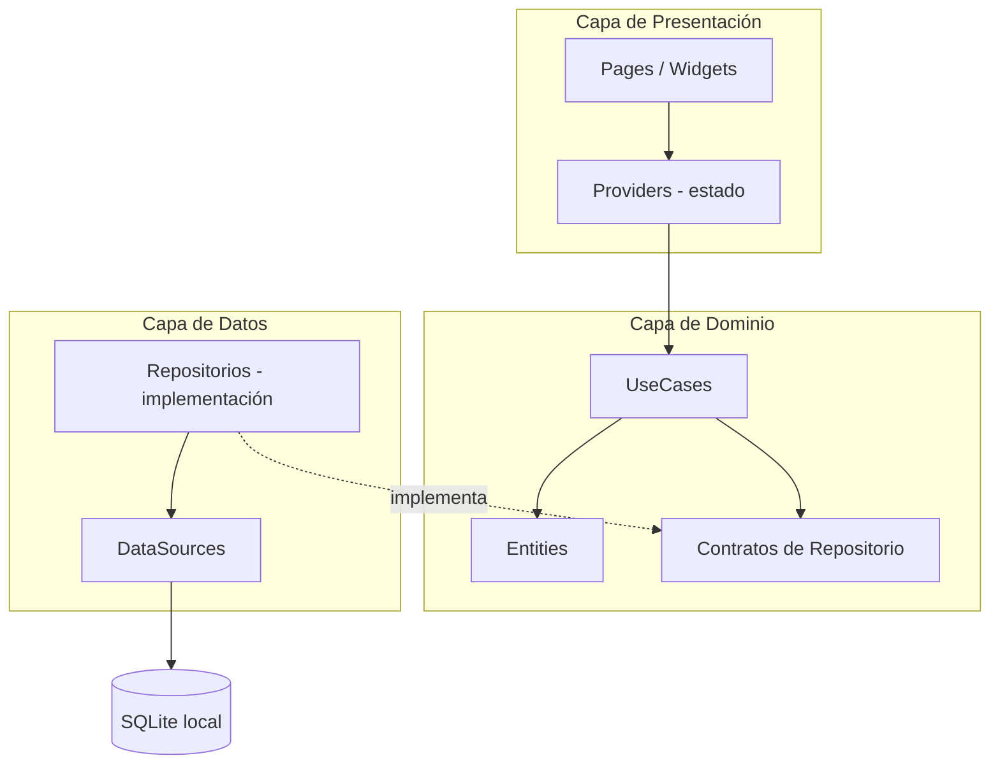
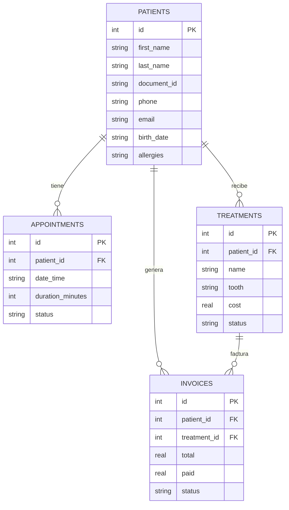

# Arquitectura del Sistema — Clínica Dental

## Visión general

Aplicación de escritorio **offline-first**: toda la información se guarda en una base de datos **SQLite local**, ideal para el equipo de recepción/consultorio sin depender de internet.

## Regla de dependencias

- `presentation` solo conoce a `domain` (nunca a `data`).
- `domain` no depende de nada externo (Flutter, SQLite, etc.).
- `data` implementa los contratos definidos en `domain`.
- `core/` contiene lo transversal: tema, rutas, base de datos, utilidades.

## Módulos (features)

| Módulo | Responsabilidad |
|---|---|
| `auth` | Inicio de sesión y roles (admin, odontólogo, recepción) |
| `dashboard` | Indicadores del día: citas, ingresos, pacientes nuevos |
| `patients` | CRUD de pacientes, historial clínico, alergias |
| `appointments` | Agenda: crear, reprogramar y cancelar citas |
| `treatments` | Tratamientos por pieza dental, estado y costo |
| `billing` | Facturas, pagos parciales y saldos |
| `reports` | Estadísticas e informes exportables |

## Modelo de datos (SQLite)

El esquema se crea en `lib/core/database/database_helper.dart`.

## Flujo típico (ejemplo: registrar paciente)

1. `PatientsPage` (presentation) llama al `PatientsProvider`.
2. El provider ejecuta el caso de uso `CreatePatient` (domain).
3. El caso de uso usa el contrato `PatientRepository` (domain).
4. `PatientRepositoryImpl` (data) mapea la entidad a modelo y la guarda vía el `DataSource` en SQLite.

## Convenciones

- Un archivo por clase; nombres en `snake_case.dart`.
- Las entidades usan `Equatable` para comparación por valor.
- Las rutas se registran únicamente en `core/router/app_router.dart`.
- Los textos visibles al usuario van en español.
